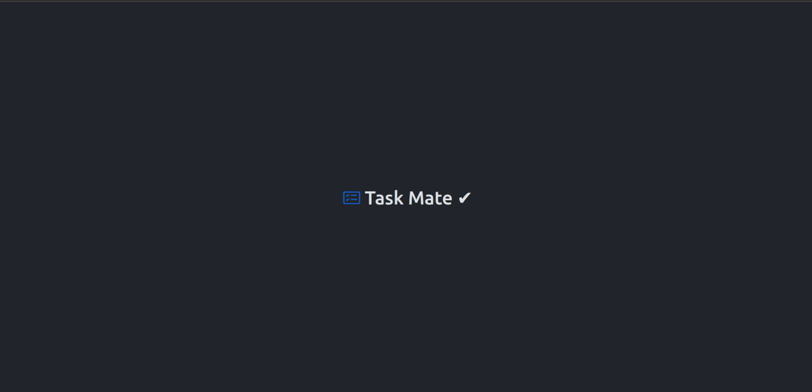
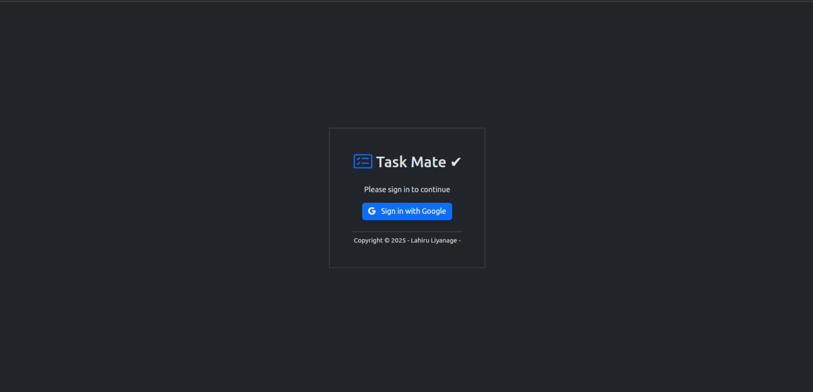
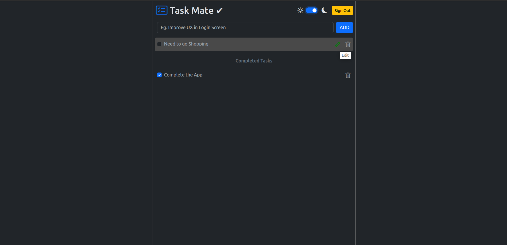
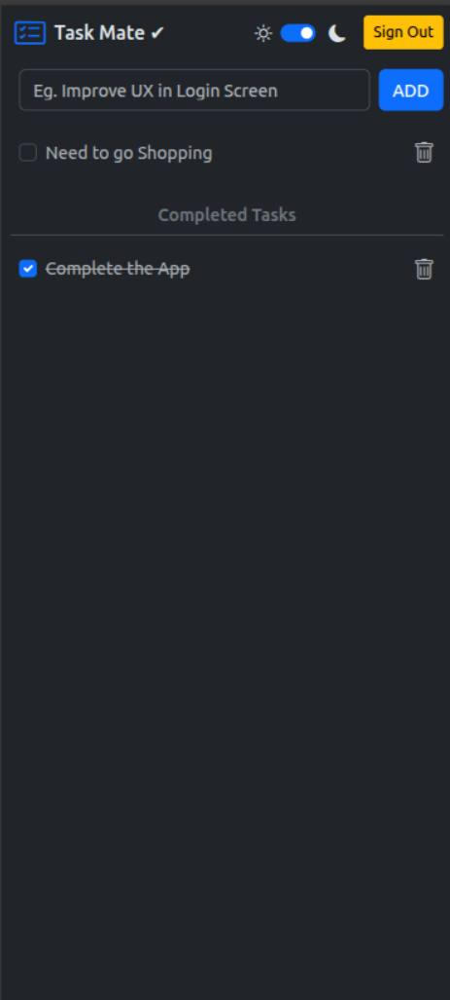

# TaskMate ✅📝

**Streamlined Task Management with Firebase Integration**

TaskMate is a lightweight, intuitive to-do application built with vanilla JavaScript, HTML, and CSS. Powered by Firebase backend services, it offers secure task management with Google Authentication, allowing users to create, organize, and track tasks efficiently through a clean, responsive interface.

You can Simply try by - [APP Link](https://to-do-list-7aea7.web.app)

## 🚀 Features

- **Intuitive UI** – Clean, responsive design for managing tasks easily
- **Google Authentication** – Secure user access via Firebase Authentication
- **Real-time Updates** – Instant synchronization of tasks across devices
- **Task Organization** – Create, edit, delete, and mark tasks as complete
- **Data Persistence** – Reliable cloud storage with Firebase
- **Responsive Design** – Optimized for both desktop and mobile devices
- **Open-Source** – Modify and enhance as needed!

## 🛠️ Technologies Used

### Core Technologies
- **HTML5** – Semantic markup structure
- **CSS3** – Modern styling with flexbox/grid layouts
- **Vanilla JavaScript** – Core programming without frameworks
- **Vite** – Next-generation frontend tooling

### Firebase Services
- **Firebase Authentication** – Google sign-in implementation
- **Firebase Firestore** – NoSQL database for task storage
- **Firebase Hosting** – Deployment and hosting solution

### Development Tools
- **Git** – Version control system
- **npm** – Package management
- **ESLint** – Code quality and consistency

## 📸 Screenshots

<table>
  <tr>
    <td></td>
    <td></td>
    <td></td>
    <td></td>
  </tr>
  <tr>
    <td align="center"><b>Splash Screen</b></td>
    <td align="center"><b>Login Screen</b></td>
    <td align="center"><b>Task Dashboard</b></td>
    <td align="center"><b>Mobile Responsiveness</b></td>
  </tr>
</table>

## 🔧 How It Works

1. **User Authentication** – Sign in securely with Google credentials
2. **Task Management** – Create, view, edit, and delete tasks
3. **Status Tracking** – Mark tasks as complete or pending
4. **Data Synchronization** – All changes instantly sync to Firebase
5. **Responsive Design** – Seamless experience across all devices

### Technical Implementation
- Uses Firebase SDK for authentication and database operations
- Implements ES6+ JavaScript features for modern code structure
- Employs Vite for optimized build process and hot module replacement
- Utilizes custom CSS for responsive design without frameworks
- Implements event delegation for efficient DOM manipulation

## 🛠️ Installation & Usage

### Prerequisites
- Node.js (14.x or higher)
- npm or yarn
- Firebase account

### Setting Up Firebase
1. Create a new Firebase project
2. Enable Google Authentication
3. Set up Firestore database
4. Register a web app and get your configuration

### Running the Application

```sh
# Clone the repository
git clone https://github.com/YourUsername/taskmate.git

# Navigate to the project
cd taskmate

# Install dependencies
npm install

# Add your Firebase configuration to src/firebase.js
# Example:
# const firebaseConfig = {
#   apiKey: "YOUR_API_KEY",
#   authDomain: "YOUR_PROJECT_ID.firebaseapp.com",
#   projectId: "YOUR_PROJECT_ID",
#   storageBucket: "YOUR_PROJECT_ID.appspot.com",
#   messagingSenderId: "YOUR_MESSAGING_SENDER_ID",
#   appId: "YOUR_APP_ID"
# };

# Start development server
npm run dev

# Build for production
npm run build
```

### Folder Structure
```
TaskMate/
│── src/
│   │── assets/
│   │── css/
│   └── js/
├── index.html
├── package.json
├── vite.config.js
├── README.md
└── LICENSE.txt
```

## ⚠️ Disclaimer
This application is created for demonstration purposes. While it uses Firebase Authentication, ensure you review security best practices for production use.

## 📌 Future Enhancements
- Add **task categories** for better organization
- Implement **due dates** and **reminders**
- Add **dark/light mode** toggle
- Create **shared task lists** between users
- Implement **offline mode** with local storage
- Add **drag-and-drop** task reordering

## 🤝 Contributing
Feel free to fork this repository and improve its capabilities. PRs are welcome!

## 📜 License
This project is licensed under the [MIT License](LICENSE.txt).

## 📩 Contact

For any questions or feedback, feel free to reach out:

- Mobile: [+94719607296](+94719607296)
- Email: [lhlahiru95@gmail.com](lhlahiru95@gmail.com)
- LinkedIn: [LahiruLiyanage](https://www.linkedin.com/in/liyanage-lahiru/)
- GitHub: [@LahiruLiyanage](https://github.com/LahiruLiyanage)
- WebSite: [lahiruliyanage.com](www.lahiruliyanage.com)

## 🔗 Stay organized with TaskMate! ##

---